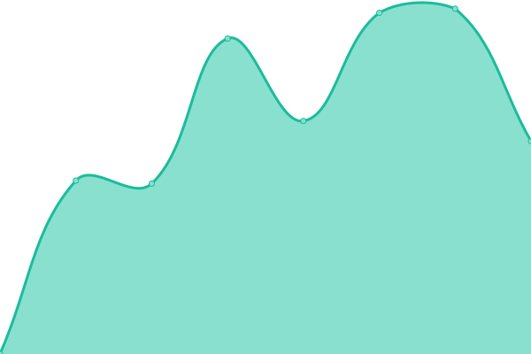
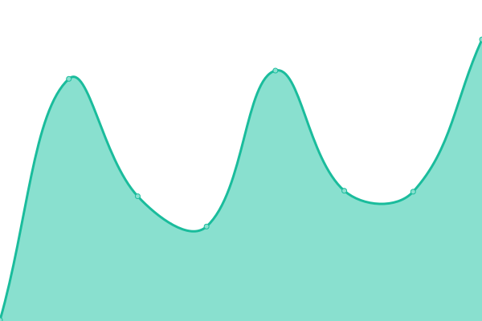

# [📈 Live Status](https://juanretamales.github.io/Sunai-Upptime): <!--live status--> **🟧 Partial outage**

This repository contains the open-source uptime monitor and status page for [Juan Retamales](http://www.juanretamales.cl/), powered by [Upptime](https://github.com/upptime/upptime).

With [Upptime](https://upptime.js.org), you can get your own unlimited and free uptime monitor and status page, powered entirely by a GitHub repository. We use [Issues](https://github.com/juanretamales/Sunai-Upptime/issues) as incident reports, [Actions](https://github.com/juanretamales/Sunai-Upptime/actions) as uptime monitors, and [Pages](https://juanretamales.github.io/Sunai-Upptime) for the status page.

<!--start: status pages-->
<!-- This summary is generated by Upptime (https://github.com/upptime/upptime) -->
<!-- Do not edit this manually, your changes will be overwritten -->
<!-- prettier-ignore -->
| URL | Status | History | Response Time | Uptime |
| --- | ------ | ------- | ------------- | ------ |
|  [Sunai Website](https://sunai.cl/en/) | 🟩 Up | [sunai-website.yml](https://github.com/juanretamales/Sunai-Upptime/commits/HEAD/history/sunai-website.yml) | 

 6276ms
     
 | 

<a href="https://juanretamales.github.io/Sunai-Upptime/history/sunai-website">100.00%</a>
    

|  [Neural](https://neural.sunai.cl/) | 🟩 Up | [neural.yml](https://github.com/juanretamales/Sunai-Upptime/commits/HEAD/history/neural.yml) | 

 372ms
     
 | 

<a href="https://juanretamales.github.io/Sunai-Upptime/history/neural">100.00%</a>
    

|  File Terminal | 🟩 Up | [file-terminal.yml](https://github.com/juanretamales/Sunai-Upptime/commits/HEAD/history/file-terminal.yml) | 

 85ms
     
 | 

<a href="https://juanretamales.github.io/Sunai-Upptime/history/file-terminal">96.70%</a>
    

|  File Terminal Services | 🟥 Down | [file-terminal-services.yml](https://github.com/juanretamales/Sunai-Upptime/commits/HEAD/history/file-terminal-services.yml) | 

 0ms
     
 | 

<a href="https://juanretamales.github.io/Sunai-Upptime/history/file-terminal-services">23.56%</a>
    

<!--end: status pages-->

[**Visit our status website →**](https://juanretamales.github.io/Sunai-Upptime)

## 📄 License

- Powered by: [Upptime](https://github.com/upptime/upptime)
- Code: [MIT](./LICENSE) © [Juan Retamales](http://www.juanretamales.cl/)
- Data in the `./history` directory: [Open Database License](https://opendatacommons.org/licenses/odbl/1-0/)
